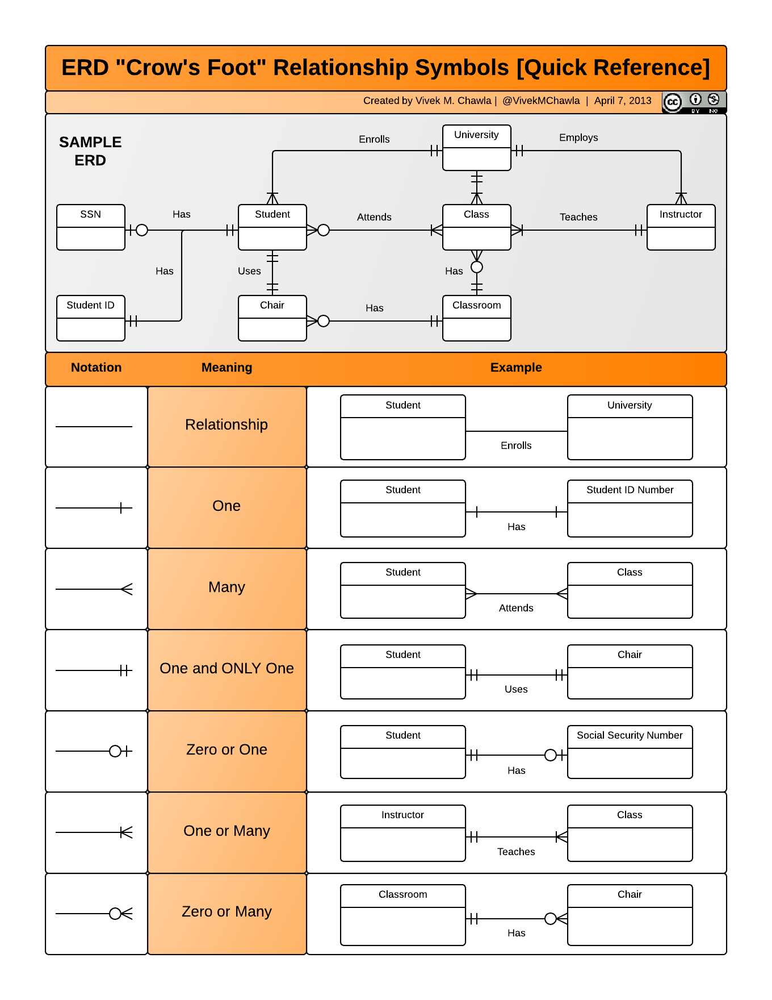

# Week 4

*Prof. Nitin Chandrachoodan*  
*Department of EE, IIT Madras*  

*Notes by Adarsh (23f2003570)*  

## [L4.1: Persistent Storage 13:29](https://youtu.be/g7zpeaK4jEc)

Talks about Spreadsheets

## [L4.2: Mechanisms for Persistent Storage and Relational Databases (22:32)](https://youtu.be/ciReAG-1BQY)

Talks about Spreadsheets, External Data Stores etc etc

## [L4.3: Relations and ER Diagram (25:24)](https://youtu.be/fMdgUiX_Di0)

Talks about relations - please refer to my DBMS notes

### Crows Foot

### Relationships

**One-to-many relationship is a type of cardinality that defines a relationship between two entities $A$ and $B$ where an element in $A$ may be linked to multiple elements in $B$ but an element in $B$ is linked to only one element in $A$**

#### 1. **Types of Relationships**
   - **One-to-One (1:1)**: Each record in Relation A is associated with exactly one record in Relation B and vice versa.
   - **One-to-Many (1:N)**: A record in Relation A can be associated with multiple records in Relation B, but each record in Relation B is associated with only one record in Relation A.
   - **Many-to-One (N:1)**: Multiple records in Relation A can be associated with a single record in Relation B, which is essentially the reverse of a one-to-many relationship.
   - **Many-to-Many (M:N)**: Records in Relation A can be associated with multiple records in Relation B and vice versa. This relationship usually requires a junction (or associative) table to manage the associations.

#### 2. **Referential Integrity**
   - Ensures that relationships between tables remain consistent. For example, if a foreign key in Relation B refers to a primary key in Relation A, the value in the foreign key must match an existing primary key in Relation A or be null.

#### 3. **Foreign Keys**
   - A foreign key is an attribute (or a set of attributes) in one relation that refers to the primary key of another relation. Foreign keys establish a link between the two relations, facilitating the relationship.

#### 4. **Cascading Actions**
   - **Cascade on Delete**: If a record in the parent table (Relation A) is deleted, all related records in the child table (Relation B) are also automatically deleted.
   - **Cascade on Update**: If the primary key in the parent table is updated, the corresponding foreign key values in the child table are also updated.

#### 5. **Cardinality Constraints**
   - Defines the numerical relationships between two relations:
     - **Minimum Cardinality**: The minimum number of instances of one entity that can be associated with one instance of another entity (e.g., zero or one).
     - **Maximum Cardinality**: The maximum number of instances of one entity that can be associated with one instance of another entity (e.g., one or many).

#### 6. **Participation Constraints**
   - Specifies whether all or only some entity occurrences participate in a relationship:
     - **Total Participation**: Every instance of an entity must participate in the relationship (represented as a double line in ER diagrams).
     - **Partial Participation**: Only some instances of an entity participate in the relationship (represented as a single line in ER diagrams).

#### 7. **Associative Entities**
   - Used to represent many-to-many relationships. An associative entity is a table that holds foreign keys referencing the primary keys of the two related entities, along with any additional attributes related to the relationship.

#### 8. **Hierarchical Relationships**
   - Sometimes, relationships can be hierarchical (parent-child). This is common in organizational structures, where a manager (parent) can have multiple employees (children).

#### 9. **Normalization**
   - The process of organizing data to minimize redundancy and dependency, which involves establishing proper relationships between tables through normalization forms (1NF, 2NF, 3NF, etc.).

#### 10. **Aggregation and Composition**
   - **Aggregation**: A higher-level entity is created from a set of relationships. It can encapsulate multiple relationships.
   - **Composition**: A strong relationship where the lifetime of the part entity is tied to the lifetime of the whole entity. If the whole is deleted, so are the parts.

#### 11. **Derived Relationships**
   - These are relationships that can be inferred from existing relationships. For example, if a relationship exists between A and B, and between B and C, a derived relationship can be inferred between A and C.

#### 12. **Complex Relationships**
   - Relationships can have attributes of their own, such as "date of association" or "role in the relationship," which can be useful for additional context.

## [L4.4: SQL](https://youtu.be/JCmvYAiI7oY)
Basically same concepts in DBMS and talk of Models, Views, Controllers