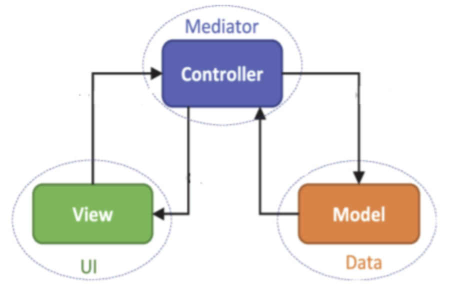

<<<<<<< HEAD
# Week 5

*Prof. Nitin Chandrachoodan*  
*Department of EE, IIT Madras*  

*Notes by Adarsh (23f2003570)*  


## [L5.1: MVC Origins 18:46](https://youtu.be/hW0w6YqeDpU)

MVC - Model View Controller.


- Model Updates View
- Controller Manipulates Model
- User Uses Controller to change the view
- View is seen by user.
- User centric
  - No connection between user and DB
  - Trygve Reenskaug, Xerox PARC

### MVC with Flask vs ASP.NET Core MVC

Both Flask and ASP.NET Core MVC follow the Model-View-Controller (MVC) design pattern for web development.

MVC separates an application into three parts:

* **Model:** Represents the data of the application, including its structure and logic. It handles data access (e.g., database interaction) and business logic.
* **View:** Presents the user interface (UI) of the application. It uses templates to dynamically generate HTML based on data received from the controller.
* **Controller:** Handles user requests (routes). It interacts with the model to retrieve data and sends it to the view for presentation.


#### MVC in Flask

Flask is a lightweight Python framework. While it doesn't strictly enforce an MVC structure, you can implement it for better organization. Here's how it works:

* **Model:** Often implemented using libraries like SQLAlchemy for database access. You create Python classes representing your data structure.
* **View:** Uses Jinja2 templating engine to generate HTML based on data passed by the controller. You define templates with HTML and Jinja2 directives to dynamically insert data.
* **Controller:** Flask uses decorators (e.g., `@app.route`) to map URLs to functions. These functions handle user requests, interact with the model, and pass data to the view template for rendering.

**Key Points:**

* Flask is **flexible**. You can implement MVC loosely or tightly depending on your project needs.
* Flask offers **minimal structure**, requiring more manual configuration compared to ASP.NET Core MVC.

#### MVC in ASP.NET Core MVC

ASP.NET Core MVC is a full-fledged web framework built by Microsoft. It enforces a stricter MVC structure and provides built-in features for each layer.

* **Model:** Similar to Flask, you use C# classes or Entity Framework Core for data access.
* **View:** Uses Razor Pages or MVC Views for UI generation. Razor provides syntax for embedding C# code within HTML templates.
* **Controller:** Similar to Flask, controllers handle user requests, interact with the model, and pass data to the view. ASP.NET Core includes built-in features like model binding and routing.

**Key Points:**

* ASP.NET Core MVC provides a **structured** environment with clear separation of concerns.
* Offers features like **dependency injection** and built-in functionalities for routing and model binding.

#### Comparison

| Feature        | Flask                                      | ASP.NET Core MVC                               |
|----------------|--------------------------------------------|-------------------------------------------------|
| Language       | Python                                      | C#, F#, VB.NET (primarily C#)                  |
| MVC Structure   | Flexible implementation                     | Strict enforcement                              |
| Complexity      | Lightweight, minimal configuration         | More complex with built-in features             |
| Community      | Large and active Python community            | Large and active .NET community                |
| Platform        | Cross-platform (Windows, Linux, macOS)     | Primarily Windows (cross-platform via .NET Core) |
| View Engine    | Jinja2                                       | Razor Pages or MVC Views                       |
| Data Access     | Requires additional libraries                  | Entity Framework Core (built-in)                 |
| Routing         | Manual configuration with decorators          | Built-in routing feature                         |
| Dependency Injection | Requires manual implementation (optional) | Built-in dependency injection framework           |


#### Choosing the Right Framework

* **Choose Flask if:**
    * You need a lightweight and flexible framework.
    * You prioritize rapid development and ease of use.
    * Your project is in Python and you prefer a smaller codebase.
* **Choose ASP.NET Core MVC if:**
    * You need a full-fledged framework with built-in features.
    * You value a structured development environment.
    * Your project is in C# and you want features like dependency injection and strong typing.
    * You primarily develop for Windows (or use .NET Core for cross-platform).

### AQ 5.1

- A user uses ______ to manipulate the ______ that updates the ______ which the user sees.
  - ~~controller, model, view~~ `Struck through to help develop your reasoning`
- Which of the following is/are the area of benefit(s) in MVC architecture?
  - Ability to provide multiple views ~~Yes: Same Data Instance, Multiple Views~~
  - SOC-Separation of concerns ~~Users cannot influence the Model without validation~~
  - Easier to debug. ~~If we know View, We know Controller Path~~



  - controller will update the view as per the inputs given by the use
  - The view will determine how the processed data will be displayed to the user.
  - User uses the controller which is able to manipulate the model.

- MVC Properties
  - The model defines what data the app should contain.
  - The controller contains the logic that updates the model. Model is the underlying data structure
  - The view should define how the data is presented to the user and receive the data to display from the models
  - controller updates the view directly in response to input from the users of the app.

- ________ stores the data, ________shows data to the user, and the ________ which takes care of the action.
  - ~~Model, view, controller~~

=======
# Week 5

*Prof. Nitin Chandrachoodan*  
*Department of EE, IIT Madras*  

*Notes by Adarsh (23f2003570)*  


## [L5.2: Requests and Responses (14.42)](https://youtu.be/K7IJ3n6lPsE)

### Requests and Responses

1. **Definition**: A request is an object that encapsulates the information sent by a client (usually a web browser) to a server, asking for some resource or action.

2. **Components of a Request**:
   - **HTTP Method**: Indicates the type of action to be performed. Common methods include:
     - `GET`: Retrieve data.
     - `POST`: Submit data to be processed.
     - `PUT`: Update existing resources.
     - `DELETE`: Remove resources.
   - **URL**: The endpoint indicating the resource or action. It may include path parameters and query parameters.
   - **Headers**: Additional information about the request (e.g., content type, authorization tokens).
   - **Body**: Data sent with the request, typically used in `POST` or `PUT` requests, often in JSON or form-data format.

3. **Controller Role**:
   - **Routing**: Controllers are often responsible for handling specific routes based on the request method and URL.
   - **Validation**: Controllers may validate request data before processing.
   - **Processing**: Controllers execute the necessary logic to handle the request, interacting with models or services as needed.

#### Responses

1. **Definition**: A response is the data sent back from the server to the client after processing a request. It indicates the outcome of the requested operation.

2. **Components of a Response**:
   - **Status Code**: A numerical code representing the outcome of the request (e.g., `200 OK`, `404 Not Found`, `500 Internal Server Error`).
   - **Headers**: Metadata about the response, such as content type and caching information.
   - **Body**: The actual data being sent back, which can be HTML, JSON, XML, or other formats, depending on the request and the API design.

3. **Controller Role**:
   - **Formatting**: Controllers often format the response data based on the client's needs (e.g., converting data to JSON).
   - **Error Handling**: Controllers manage errors by returning appropriate status codes and messages.
   - **Data Representation**: Controllers may use view models or serializers to structure the response data.

#### Interaction Between Requests and Responses

- **Lifecycle**: The interaction begins when a client makes a request to a server. The server’s routing mechanism directs the request to the appropriate controller action, which processes the request and generates a response. Finally, the server sends the response back to the client.
- **Statelessness**: HTTP is a stateless protocol, meaning each request is independent. Controllers must manage state across requests using mechanisms like sessions or tokens.
- **RESTful Principles**: In RESTful architectures, requests and responses are designed to operate on resources, using standard HTTP methods, URIs, and status codes to indicate outcomes clearly.

#### Best Practices

1. **Consistent Structure**: Maintain a consistent structure for requests and responses, making it easier for clients to interact with the API.
2. **Error Handling**: Implement comprehensive error handling to return meaningful error responses with appropriate status codes.
3. **Validation**: Always validate incoming request data to prevent issues and improve security.
4. **Documentation**: Provide clear API documentation, detailing request formats, expected responses, and possible error codes.

## [L5.3: CRUD (10:58)](https://youtu.be/cHbdUv5nwyY)

### Overview of CRUD in Flask

1. **Create**: Add new records to the database.
2. **Read**: Retrieve existing records from the database.
3. **Update**: Modify existing records in the database.
4. **Delete**: Remove records from the database.

#### Setting Up Flask for CRUD

1. **Install Flask and Required Libraries**:
   - You need Flask and a database toolkit like SQLAlchemy. Install them using pip:
     ```bash
     pip install Flask Flask-SQLAlchemy
     ```

2. **Basic Flask Application Structure**:
   - Create a basic Flask application with a simple folder structure.
   - Example: 
     ```
     /my_flask_app
     ├── app.py
     └── models.py
     ```

3. **Configuration**:
   - Set up your Flask application and configure the database connection in `app.py`:

     ```python
     from flask import Flask
     from flask_sqlalchemy import SQLAlchemy

     app = Flask(__name__)
     app.config['SQLALCHEMY_DATABASE_URI'] = 'sqlite:///data.db'
     db = SQLAlchemy(app)
     ```

#### Defining the Model

In `models.py`, define a model that represents your data. For example, a simple `Item` model:

```python
from app import db

class Item(db.Model):
    id = db.Column(db.Integer, primary_key=True)
    name = db.Column(db.String(100), nullable=False)
    description = db.Column(db.String(200))

    def __repr__(self):
        return f"<Item {self.name}>"
```

#### Implementing CRUD Operations

##### 1. Create

To create a new record, you can use a route that handles POST requests. Here’s an example:

```python
from flask import request, jsonify

@app.route('/items', methods=['POST'])
def create_item():
    data = request.get_json()
    new_item = Item(name=data['name'], description=data['description'])
    db.session.add(new_item)
    db.session.commit()
    return jsonify({'message': 'Item created!', 'item': {'id': new_item.id, 'name': new_item.name}}), 201
```

##### 2. Read

To read records, you can create routes for fetching all items or a specific item:

```python
@app.route('/items', methods=['GET'])
def get_items():
    items = Item.query.all()
    return jsonify([{'id': item.id, 'name': item.name, 'description': item.description} for item in items])

@app.route('/items/<int:item_id>', methods=['GET'])
def get_item(item_id):
    item = Item.query.get_or_404(item_id)
    return jsonify({'id': item.id, 'name': item.name, 'description': item.description})
```

##### 3. Update

To update an existing record, create a route that handles PUT requests:

```python
@app.route('/items/<int:item_id>', methods=['PUT'])
def update_item(item_id):
    item = Item.query.get_or_404(item_id)
    data = request.get_json()
    item.name = data.get('name', item.name)
    item.description = data.get('description', item.description)
    db.session.commit()
    return jsonify({'message': 'Item updated!', 'item': {'id': item.id, 'name': item.name}})
```

##### 4. Delete

To delete a record, create a route that handles DELETE requests:

```python
@app.route('/items/<int:item_id>', methods=['DELETE'])
def delete_item(item_id):
    item = Item.query.get_or_404(item_id)
    db.session.delete(item)
    db.session.commit()
    return jsonify({'message': 'Item deleted!'})
```

#### Running the Application

- Make sure to create the database before running the application. You can do this by executing:
  ```python
  from app import db
  db.create_all()
  ```

- Finally, run your Flask application:
  ```bash
  if __name__ == '__main__':
      app.run(debug=True)
  ```

#### Testing CRUD Operations

You can test your CRUD endpoints using tools like Postman, curl, or directly through a front-end application:

- **Create**: Send a POST request to `/items` with a JSON body like:
  ```json
  {
    "name": "Sample Item",
    "description": "This is a sample item."
  }
  ```

- **Read**: Send GET requests to `/items` or `/items/{id}`.

- **Update**: Send a PUT request to `/items/{id}` with updated JSON data.

- **Delete**: Send a DELETE request to `/items/{id}`.


### API Notes, Python

#### Overview of APIs in Python

1. **Definition**: An API defines a set of rules and conventions for how different software components should interact. In web development, APIs allow clients (like web browsers or mobile apps) to request and manipulate resources on a server.

2. **Types of APIs**:
   - **RESTful APIs**: Follow REST (Representational State Transfer) principles, using standard HTTP methods (GET, POST, PUT, DELETE).
   - **GraphQL APIs**: Allow clients to request only the data they need, using a single endpoint.
   - **SOAP APIs**: Use XML-based messaging protocols, although less common in modern web applications.

3. **Frameworks for Building APIs in Python**:
   - **Flask**: A micro-framework that can be easily extended to build RESTful APIs.
   - **Django REST Framework**: A powerful toolkit for building Web APIs in Django applications.
   - **FastAPI**: A modern framework for building APIs with Python 3.7+ based on standard Python type hints, known for its speed.

#### Building a Simple RESTful API in Flask

1. **Install Flask**:
   ```bash
   pip install Flask
   ```

2. **Basic API Structure**:
   Create a file named `app.py`.

   ```python
   from flask import Flask, jsonify, request

   app = Flask(__name__)

   items = []

   @app.route('/items', methods=['GET'])
   def get_items():
       return jsonify(items)

   @app.route('/items', methods=['POST'])
   def create_item():
       data = request.get_json()
       items.append(data)
       return jsonify(data), 201

   if __name__ == '__main__':
       app.run(debug=True)
   ```

##### Testing the API

You can test this API using tools like Postman or curl.

- **Get all items**: `GET /items`
- **Create an item**: `POST /items` with a JSON body, e.g.:
  ```json
  {
      "name": "Sample Item",
      "description": "This is a sample item."
  }
  ```

##### Best Practices for API Design

1. **Use RESTful Principles**:
   - Use standard HTTP methods: `GET` for retrieval, `POST` for creation, `PUT` for updates, and `DELETE` for deletion.
   - Use proper status codes to indicate the result of API calls (e.g., `200 OK`, `201 Created`, `404 Not Found`, `500 Internal Server Error`).

2. **Consistent URL Structure**:
   - Use clear and meaningful resource names in URLs (e.g., `/items`, `/users`).
   - Follow a consistent naming convention, such as plural nouns for resources.

3. **Version Your API**:
   - Include a version number in the URL (e.g., `/v1/items`) to manage changes over time without breaking existing clients.

4. **Use JSON for Data Exchange**:
   - JSON is widely used and supported across platforms. Ensure your API can send and receive JSON formatted data.

5. **Authentication and Authorization**:
   - Implement proper security measures, such as OAuth2, API keys, or JWT (JSON Web Tokens), to protect sensitive endpoints.

6. **Rate Limiting**:
   - Implement rate limiting to prevent abuse and ensure fair usage of your API.

7. **Error Handling**:
   - Provide meaningful error messages in the response body, including error codes and descriptions. Standardize your error responses.

   ```json
   {
       "error": {
           "code": "NotFound",
           "message": "The requested item was not found."
       }
   }
   ```

8. **Documentation**:
   - Document your API using tools like Swagger/OpenAPI, Postman, or similar platforms to provide clear guidance to developers using your API.

9. **Test Your API**:
   - Use automated testing frameworks like `pytest` or `unittest` to ensure your API functions correctly and consistently.

10. **Performance Optimization**:
   - Implement caching strategies (e.g., using Redis or Memcached) for frequently accessed data to reduce load times and server strain.
   - Optimize database queries to minimize response time.
  


### Presentation Filters

The **Presentation Filter** is a design pattern often used in software architecture, particularly in the context of Model-View-Controller (MVC) and similar patterns. It helps to separate the presentation layer from the business logic, focusing on how data is presented to the user.

#### Overview of Presentation Filter

1. **Definition**: The Presentation Filter is a layer or component that transforms data from the model into a format suitable for the view, allowing for a cleaner separation between how data is structured and how it is displayed.

2. **Purpose**: Its main role is to take raw data from the model and apply formatting, filtering, or transformation to prepare it for presentation. This can include:
   - Formatting dates and numbers.
   - Filtering or aggregating data.
   - Adding or removing properties from the data that the view will use.

3. **Context in MVC**:
   - In the MVC architecture, the **Model** represents the data and business logic, the **View** is responsible for displaying the data, and the **Controller** manages the flow of data between the model and the view.
   - The Presentation Filter acts as an intermediary between the model and the view, ensuring that the view receives data in a suitable format.

#### Implementation of Presentation Filter

Suppose you have a web application that displays a list of products, and each product has a price that needs to be formatted (e.g., displaying it as currency) before showing it to the user.

1. **Model**: Represents the product data.
   ```python
   class Product:
       def __init__(self, name, price):
           self.name = name
           self.price = price  # Raw price as a float
   ```

2. **Presentation Filter**: Transforms the model data into a presentable format.
   ```python
   class ProductPresentationFilter:
       @staticmethod
       def format_product(product):
           return {
               'name': product.name,
               'price': f"${product.price:.2f}"  # Format price as currency
           }
   ```

3. **Controller**: Handles the request and response cycle, using the filter to prepare data for the view.
   ```python
   from flask import Flask, jsonify

   app = Flask(__name__)

   products = [Product("Widget", 19.99), Product("Gadget", 25.50)]

   @app.route('/products', methods=['GET'])
   def get_products():
       filtered_products = [ProductPresentationFilter.format_product(product) for product in products]
       return jsonify(filtered_products)
   ```

4. **View**: Receives the formatted data for rendering.
   - In a web context, this could be an HTML template that uses the formatted data to display products in a user-friendly way.

#### Benefits of Using a Presentation Filter

1. **Separation of Concerns**: By isolating the presentation logic, you keep your business logic clean and maintainable. Changes to how data is displayed do not affect how it is processed.

2. **Reusability**: The presentation filter can be reused across different views or components that require similar data formatting, reducing code duplication.

3. **Testability**: By separating data formatting from business logic, you can independently test your presentation filter, ensuring that the data is formatted correctly without needing to involve the model or view.

4. **Flexibility**: If you need to change how data is presented (e.g., switching from USD to EUR), you only need to update the presentation filter without modifying the underlying data structure.

## [L5.4: Group Actions by Controller (15:15)](https://youtu.be/boQZMoN0TAQ)

### Actions and Controllers
#### Controllers

1. **Definition**: 
   - A controller is a central component of the MVC architecture that handles user requests, interacts with the model, and determines the appropriate response.
   
2. **Responsibilities**:
   - **Routing Requests**: Receives HTTP requests from clients and routes them to the appropriate actions based on the request method (GET, POST, etc.) and the URL path.
   - **Business Logic**: Encapsulates the business logic of the application. It often calls methods on the model to retrieve or manipulate data.
   - **Response Handling**: Prepares and sends the response back to the client, which may include rendering a view or returning JSON data.
   - **Middleware Integration**: Can work with middleware for cross-cutting concerns like authentication, logging, and error handling.

3. **Example in Flask**:
   ```python
   from flask import Flask, request, jsonify

   app = Flask(__name__)

   @app.route('/items', methods=['GET'])
   def get_items():
       # Logic to retrieve items from the model
       return jsonify({'items': []})

   @app.route('/items', methods=['POST'])
   def create_item():
       # Logic to create a new item
       data = request.get_json()
       return jsonify({'message': 'Item created!', 'item': data}), 201
   ```

#### Actions

1. **Definition**: 
   - Actions are specific methods or functions defined within a controller that handle particular tasks or user interactions. They represent the various operations that can be performed in response to user requests.

2. **Responsibilities**:
   - **Perform Specific Operations**: Each action typically corresponds to a specific operation, such as creating, reading, updating, or deleting resources.
   - **Handle Input and Output**: Actions process user input, often validating it, and prepare the output to be returned to the client.
   - **Coordinate with Models**: Actions frequently call model methods to perform business logic related to their specific task.

3. **Example in Flask**:
   ```python
   @app.route('/items/<int:item_id>', methods=['GET'])
   def get_item(item_id):
       # Action to retrieve a specific item by ID
       return jsonify({'item_id': item_id, 'name': 'Sample Item'})

   @app.route('/items/<int:item_id>', methods=['PUT'])
   def update_item(item_id):
       # Action to update an existing item
       data = request.get_json()
       return jsonify({'message': 'Item updated!', 'item_id': item_id})
   ```

#### Key Differences Between Actions and Controllers

1. **Scope**:
   - **Controller**: Represents a broader entity that can encompass multiple actions. It is responsible for routing and managing the overall flow of requests.
   - **Actions**: Are specific functions or methods within a controller that execute particular tasks based on user requests.

2. **Functionality**:
   - **Controller**: May include logic for handling requests, interacting with multiple models, and determining which action to call.
   - **Actions**: Contain the detailed logic for specific operations, such as data validation, processing, and generating responses.

3. **Organization**:
   - Controllers often serve as a namespace for organizing related actions. For instance, you might have a `UserController` with actions like `create_user`, `get_user`, and `delete_user`.

#### Example of a Controller with Actions

In a larger application, you might structure your code like this:

```python
class ItemController:
    @staticmethod
    @app.route('/items', methods=['GET'])
    def get_items():
        # Action logic
        return jsonify({'items': []})

    @staticmethod
    @app.route('/items', methods=['POST'])
    def create_item():
        # Action logic
        data = request.get_json()
        return jsonify({'message': 'Item created!', 'item': data}), 201

    @staticmethod
    @app.route('/items/<int:item_id>', methods=['GET'])
    def get_item(item_id):
        # Action logic
        return jsonify({'item_id': item_id, 'name': 'Sample Item'})

    @staticmethod
    @app.route('/items/<int:item_id>', methods=['PUT'])
    def update_item(item_id):
        # Action logic
        data = request.get_json()
        return jsonify({'message': 'Item updated!', 'item_id': item_id})
```

### URN's URI, URL

In computer networking, **URN**, **URI**, and **URL** are important concepts that deal with identifying resources on the internet.

#### 1. URI (Uniform Resource Identifier)

- **Definition**: A URI is a string of characters that uniquely identifies a resource on the internet, either by location, name, or both.
  
- **Components**: A URI can be further classified into two types:
  - **URL (Uniform Resource Locator)**: Specifies the location of a resource and how to access it.
  - **URN (Uniform Resource Name)**: Specifies a resource by name in a particular namespace but does not indicate its location.

- **Syntax**: A typical URI has the following structure:
  ```
  scheme:[//authority]path[?query][#fragment]
  ```

- **Example**: 
  - `http://example.com/page` is a URL.
  - `urn:isbn:0451450523` is a URN.

#### 2. URL (Uniform Resource Locator)

- **Definition**: A URL is a specific type of URI that provides the means to access a resource on the internet. It specifies the resource's location and the protocol to be used for accessing it (such as HTTP, FTP, etc.).

- **Components**:
  - **Scheme**: Indicates the protocol used (e.g., `http`, `https`, `ftp`).
  - **Host**: The domain name or IP address of the server (e.g., `example.com`).
  - **Path**: The specific location of the resource on the server (e.g., `/page`).
  - **Query**: Optional parameters that can be sent to the server (e.g., `?id=123`).
  - **Fragment**: An optional identifier for a specific part of the resource (e.g., `#section1`).

- **Example**: 
  - `https://www.example.com/path/to/resource?query=example#fragment`
    - **Scheme**: `https`
    - **Host**: `www.example.com`
    - **Path**: `/path/to/resource`
    - **Query**: `query=example`
    - **Fragment**: `#fragment`

#### 3. URN (Uniform Resource Name)

- **Definition**: A URN is a specific type of URI that identifies a resource by name in a particular namespace. It does not provide information on how to access the resource or its location.

- **Purpose**: URNs are intended to serve as persistent, location-independent resource identifiers. They are often used for objects that need to be uniquely identified regardless of their location.

- **Syntax**: A URN typically follows the pattern:
  ```
  urn:<namespace identifier>:<namespace-specific string>
  ```

- **Example**: 
  - `urn:isbn:0451450523` identifies a book by its ISBN number.

#### Recap URN, URI, URL

- **URI**: A broad category that encompasses both URLs and URNs. It is a general identifier for any resource.
  
- **URL**: A specific type of URI that includes the means to access a resource and its location. All URLs are URIs, but not all URIs are URLs.

- **URN**: A type of URI that names a resource without indicating where it can be found or how to access it. It focuses on the identity of the resource.
>>>>>>> 5659f1fdbbd01b18d16d3f89c9a606010ddfd2bf
